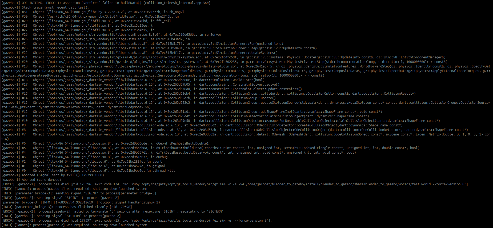

# Template To Gazebo Package
Work in Progress. This ROS2 package offers a simplified playground where you can test Blender models in Gazebo.

# Intructions
1. Import the repository.
2. Create a workspace with the package and compile it.
3. Modify the [model.blend](./models/template_blender_model/model.blend) file.
4. Export the model as [model.obj](./models/template_blender_model/source/model.obj).
5. Run the simulation.

# Troubleshooting
1. Gazebo crashes when importing model. In Blender, did you export "Selection Only" with nothing selected?
