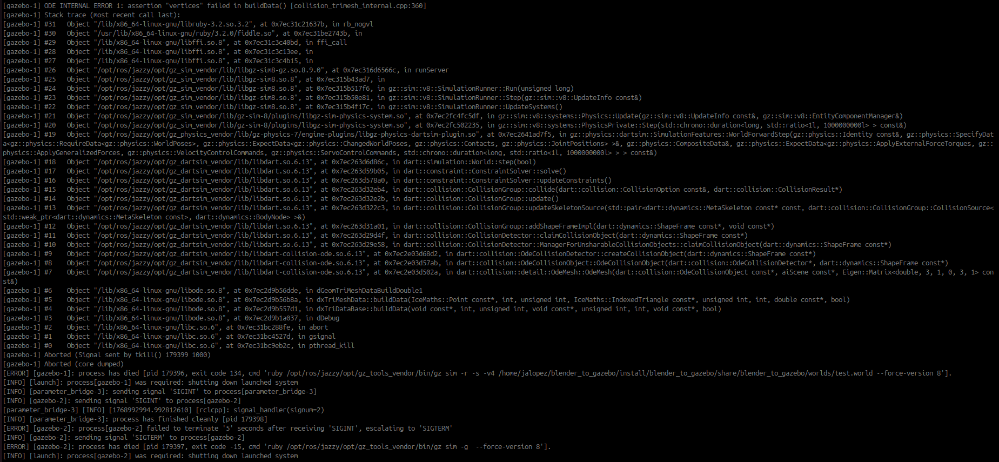

# robotnik_agrimate_simulation

Gazebo simulation package for the AgriMate project. It contains the simulation
worlds, vineyard models, resource hooks, and base launch file for spawning the
RB-Fiqus AgriMate robot.

## Launch

```bash
ros2 launch robotnik_agrimate_simulation simulation.launch.py
```

## Contents

- `launch/simulation.launch.py`: starts the world and spawns the robot.
- `worlds/`: Gazebo world files.
- `models/`: simulation assets used by the worlds.
- `hooks/`: Gazebo resource path setup.

## Build

From the workspace root:

```bash
colcon build --packages-select robotnik_agrimate_simulation
source install/setup.bash
```

## Troubleshooting

If Gazebo crashes when importing a Blender-generated model, check whether the
OBJ export was created with "Selection Only" and no selected object.


