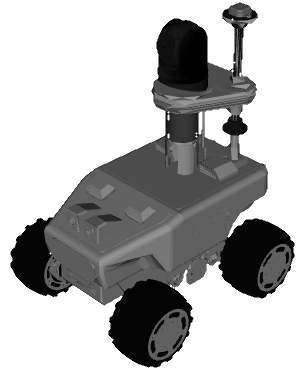
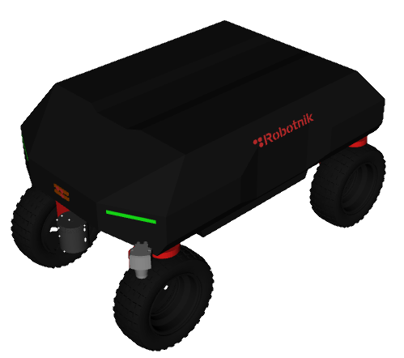
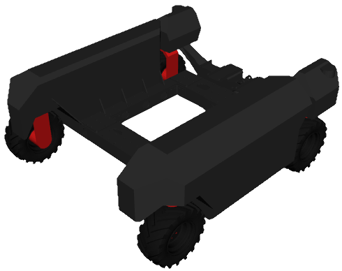
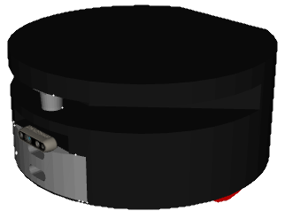

[![Contributors][contributors-shield]][contributors-url]
[![Forks][forks-shield]][forks-url]
[![Stargazers][stars-shield]][stars-url]
[![Issues][issues-shield]][issues-url]
[![License][license-shield]][license-url]
[![LinkedIn][linkedin-shield]][linkedin-url]

<p align="center">
  
</p>

<h1 align="center"></h1>

## Overview
Simulation-based environments and launch assets for Robotnik platforms on ROS 2.

<p align="center">
  
</p>

## Supported Robots

| Robot | Robot Model | Kinematics | Photos |
|-------|-------------|------------|-------|
| [RB-WATCHER](https://robotnik.eu/robotnik-robots/RB-WATCHER/) | rbwatcher | `skid-steering` |  |
| [RB-SUMMIT](https://robotnik.eu/products/mobile-robots/rb-summit/) | rbsummit | `skid-steering` |  |
| [RB-VOGUI](https://robotnik.eu/robotnik-robots/rb-vogui/) | rbvogui, rbvogui_plus | `omni-directional`, `ackermann` |  |
| [RB-VOGUI-XL](https://robotnik.eu/robotnik-robots/rb-vogui-xl/) | rbvogui_xl | `omni-directional`, `ackermann` |  |
| [RB-FIQUS](https://robotnik.eu/robotnik-robots/rb-fiqus/) | rbfiqus | `omni-directional`, `ackermann` |  |
| [RB-KAIROS](https://robotnik.eu/robotnik-robots/rb-kairos/) | rbkairos, rbkairos_plus | `omni-directional` |  |
| [RB-ROBOUT](https://robotnik.eu/robotnik-robots/rb-robout/) | rbrobout, rbrobout_plus | `omni-directional` |  |
| [RB-1*](https://robotnik.eu/robotnik-robots/rb-1/) | rb1 | `differential` |  |
| [RB-THERON](https://robotnik.eu/robotnik-robots/rb-theron/) | rbtheron, rbtheron_plus | `differential` |  |

*Note: The RB-1 robot is discontinued and may not be supported in future releases.*

## Available Simulators

| Simulator | Package | Instructions |
|-----------|---------|--------------|
| <a href="robotnik_gazebo_ignition/README.md"></a> | `robotnik_gazebo_ignition` | [README](robotnik_gazebo_ignition/README.md)


## Quick start

### Installation

Before launching the simulation, ensure that the installation steps for one of the available simulators listed above have been completed.

### Bringup

Launch complete simulation:

```
ros2 launch  robotnik_simulation_bringup bringup_complete.launch.py robot_model:=rbsummit
```


### Additional Configuration

For a complete description of available parameters and files, refer to the `robotnik_simulation_bringup` [README](common/robotnik_simulation_bringup/README.md).


## Related projects

Projects built upon this repository:

- 🕹️ [`robotnik_o3de`](https://github.com/RobotnikAutomation/robotnik_o3de): [O3DE](https://o3de.org/)-based simulation.
- 🐞 [`robotnik_webots`](https://github.com/RobotnikAutomation/robotnik_webots): [Webots](https://cyberbotics.com/) based simulation.
- 🟢 [`robotnik_isaac`](https://github.com/RobotnikAutomation/robotnik_isaac): [Isaac Sim](https://developer.nvidia.com/isaac-sim) based simulation.
- 🎮 [`robotnik_unity`](https://github.com/RobotnikAutomation/robotnik_unity): [Unity](https://unity.com/) based simulation.

## Contributing

Contributions are welcome.

1. Fork the repository
2. Create a feature branch: `git checkout -b feature/jazzy/AmazingFeature`
3. Commit: `git commit -m "Add AmazingFeature"`
4. Push: `git push origin feature/AmazingFeature`
5. Open a PR and describe your changes


Special thanks to all contributors!

<a href="https://github.com/RobotnikAutomation/robotnik_simulation/graphs/contributors">
  
</a>

## License

Distributed under **BSD-3**. See [`LICENSE`][license-url].

<!-- LINK REFS -->

[contributors-shield]: https://img.shields.io/github/contributors/RobotnikAutomation/robotnik_simulation.svg?style=for-the-badge
[contributors-url]: https://github.com/RobotnikAutomation/robotnik_simulation/graphs/contributors
[forks-shield]: https://img.shields.io/github/forks/RobotnikAutomation/robotnik_simulation.svg?style=for-the-badge
[forks-url]: https://github.com/RobotnikAutomation/robotnik_simulation/network/members
[stars-shield]: https://img.shields.io/github/stars/RobotnikAutomation/robotnik_simulation.svg?style=for-the-badge
[stars-url]: https://github.com/RobotnikAutomation/robotnik_simulation/stargazers
[issues-shield]: https://img.shields.io/github/issues/RobotnikAutomation/robotnik_simulation.svg?style=for-the-badge
[issues-url]: https://github.com/RobotnikAutomation/robotnik_simulation/issues
[license-shield]: https://img.shields.io/github/license/RobotnikAutomation/robotnik_simulation.svg?style=for-the-badge
[license-url]: LICENSE
[linkedin-shield]: https://img.shields.io/badge/-LinkedIn-black.svg?style=for-the-badge&logo=linkedin&colorB=555
[linkedin-url]: https://www.linkedin.com/company/robotnik-automation/
[product-screenshot]: docs/assets/img/ignition_simulation_view.png
