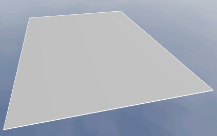
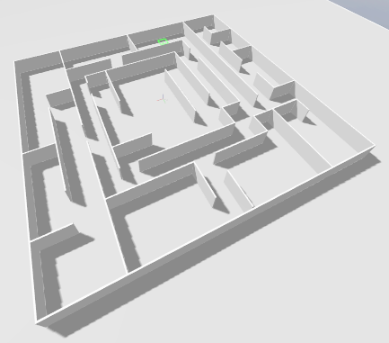
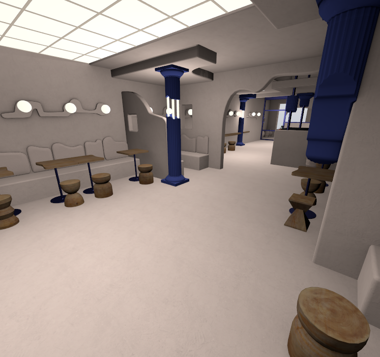

# Robotnik Gazebo Ignition


This package provides Gazebo Ignition plugins and resources for Robotnik robots.

## 📥 Installation

1. Setup sources and keys for Gazebo packages:
```sh
sudo apt update
sudo apt-get install curl lsb-release gnupg
sudo curl https://packages.osrfoundation.org/gazebo.gpg --output /usr/share/keyrings/pkgs-osrf-archive-keyring.gpg
echo "deb [arch=$(dpkg --print-architecture) signed-by=/usr/share/keyrings/pkgs-osrf-archive-keyring.gpg] http://packages.osrfoundation.org/gazebo/ubuntu-stable $(lsb_release -cs) main" | sudo tee /etc/apt/sources.list.d/gazebo-stable.list > /dev/null
```

2. Install Gazebo Harmonic.
```sh
sudo apt-get update
sudo apt-get install gz-harmonic
```

3. Install ROS 2 Jazzy and ROS-GZ bridge.
```sh
sudo apt install ros-jazzy-ros-gz
```

4. Set up workspace and install dependencies:

```sh
# Workspace
mkdir -p ~/ros2_ws/src
cd ~/ros2_ws

# Robotnik and related packages (ROS 2 Jazzy)
vcs import --input https://raw.githubusercontent.com/RobotnikAutomation/robotnik_simulation/jazzy-devel/robotnik_simulation.jazzy.repos src/

# Install prebuilt simulation debs from this repo (run at repo root)
cd ~/ros2_ws/src/robotnik/robotnik_simulation
sudo apt-get install -y ./debs/ros-${ROS_DISTRO}-*.deb

# Resolve dependencies
source /opt/ros/jazzy/setup.bash
cd ~/ros2_ws
rosdep update
rosdep install --from-paths src --ignore-src -r -y
```

5. Build the workspace:

```sh
cd ~/ros2_ws
colcon build --symlink-install
source install/setup.bash
```

## 🚀 Usage

To use the simulation, you need to spawn a world and then spawn at least one robot. Continue reading for instructions.

### 🗺️ Spawn World

First step to use this simulation is launch world where the robot will be spawned. For example, to launch the `empty` world, use the following command:

#### Basic
```bash
# Basic
ros2 launch robotnik_gazebo_ignition spawn_world.launch.py world:=empty

# With GUI disabled
ros2 launch robotnik_gazebo_ignition spawn_world.launch.py world:=empty gui:=false
```

#### Advanced
```bash
# Generic pattern
ros2 launch robotnik_gazebo_ignition spawn_world.launch.py world:=<world_name> gui:=<true|false>
```

#### Parameters
| Name | Required | Purpose | Example |
|---|---|---|---|
| `world` | no | Name of the world file (without the `.world` extension) | `empty` |
| `world_path` | no | Full path to a custom world file (overrides `world` parameter) | `/path/to/custom_world.sdf` |
| `gui` | no | Enable or disable Gazebo GUI | `true` or `false` |

#### Supported Worlds

| Name | Description | Thumbnail |
|------|-------------|-----------|
| `empty` | An empty world with a flat ground plane |  |
| `demo` | A demo world with obstacles and ramps for testing robot navigation |  |
| `ionic` | Demo world from Gazebo to show ionic simulation features |  |
| `lightweight_scene` | A lightweight scene for performance testing |  |


### 🤖 Spawn Robot

Use the launch file to insert a robot into the Gazebo (Ignition) world.

#### Basic
```bash
# Basic RB-Watcher
ros2 launch robotnik_gazebo_ignition spawn_robot.launch.py robot:=rbwatcher

# Specific ID and pose
ros2 launch robotnik_gazebo_ignition spawn_robot.launch.py robot_id:=robot_a robot:=rbwatcher robot_model:=rbwatcher x:=0.0 y:=0.0 z:=0.0 run_rviz:=true
```

#### Advanced
```bash
# Generic pattern
ros2 launch robotnik_gazebo_ignition spawn_robot.launch.py robot_id:=<unique_name> robot:=<robot_type> robot_model:=<robot_model> x:=<m> y:=<m> z:=<m>
```

#### Parameters
| Name | Required | Purpose | Example |
|---|---|---|---|
| `robot_id` | no | Instance name for the spawned robot | `robot_a` |
| `robot` | no | Robot **type** to spawn, see `supported_robots`, default is `rbwatcher` | `rbwatcher` |
| `robot_model` | no | Specific **model** within the type, see `supported_robots` | `rbwatcher` |
| `x` `y` `z` | no | Spawn position in meters | `0.0 0.0 0.0` |
| `run_rviz` | no | Launch RViz2 with a predefined configuration | `true` or `false` |
| `rviz_config` | no | Full path to a custom RViz2 configuration file (overrides default config and fixed frame must be set in config) | `/path/to/custom_config.rviz` |

#### Supported Robots

| robot          | robot_model options     | Notes |
| -------------- | ----------------------- | --- |
| rbwatcher      | rbwatcher               | Supported |
| rb1            | rb1                     | Limited |
| rbfiqus        | rbfiqus                 | Limited |
| rbkairos       | rbkairos, rbkairos_plus | Limited |
| rbrobout       | rbrobout, rbrobout_plus | Limited |
| rbsummit       | rbsummit                | Limited |
| rbsummit_steel | rbsummit_steel          | Limited |
| rbtheron       | rbtheron, rbtheron_plus | Limited |
| rbvogui        | rbvogui, rbvogui_plus   | Limited |
| rbvogui_xl     | rbvogui_xl              | Limited |

Note: "not well tested" means that the robot has been integrated but may require further validation and adjustments to ensure optimal performance in the simulation environment.

#### Types vs. models
Description package is [robotnik_description](https://github.com/RobotnikAutomation/robotnik_description), which contains all robot types and models. The distinction is:
- **Robot type**: Category such as `rbwatcher`, `summit_xl`. See the package `robots/` folder for available types. [List of supported robots](https://github.com/RobotnikAutomation/robotnik_description/tree/jazzy-devel/robots).
- **Robot model**: Concrete variant inside a type. If omitted, the default model for that type is used. See the package `robots/<robot>/models/` folder for available models. [Example models for rbwatcher](https://github.com/RobotnikAutomation/robotnik_description/tree/jazzy-devel/robots/rbwatcher).

#### Notes
- Use a unique `robot_id` when spawning multiple robots in the same world to avoid name conflicts in topics and frames.

## 🎮 Control the Robot

After spawning the robot, you can control it using command velocity messages. The two main topics for controlling the robot are:
- `/<robot-id>/robotnik_base_control/cmd_vel`: This topic is used to send velocity commands to the robot. The messages should be of type `geometry_msgs/msg/TwistStamped`.
- `/<robot-id>/robotnik_base_control/cmd_vel_unstamped`: This topic is used to send velocity commands without a timestamp. The messages should be of type `geometry_msgs/msg/Twist`.


To control the robot, you can use teleoperation packages such as `teleop_twist_keyboard` or `teleop_twist_joy`. For example, to control the robot using the keyboard, run:

```bash
sudo apt install ros-jazzy-teleop-twist-keyboard

ros2 run teleop_twist_keyboard teleop_twist_keyboard --ros-args -r cmd_vel:=/robot/robotnik_base_control/cmd_vel -p stamped:=true
```

Make sure to replace `/robot/robotnik_base_control/cmd_vel` with the appropriate topic name based on the `robot_id` you used when spawning the robot.

Also, you can use RViz plugin on the bottom right to control the robot by clicking on the arrows.

## 🎉 Enjoy

Example of RBVogui executing docking procedure in Gazebo Ignition. Currently, only for demonstration purposes, no docking controller is provided.


## Customization

### Edit robot model

Specific robot models can be customized by creating your own URDF/XACRO files based on the existing ones in the `robotnik_description` package.

1. Copy the existing robot folder from `robotnik_description/robots/<robot>/` to a new folder, e.g., `robotnik_description/robots/my_robot/`.
2. Modify the URDF/XACRO files in the new folder to add or change components as needed.
3. Update any necessary configuration files for sensors, arms, or other components.
4. Spawn the customized robot using the `robot_xacro_path` parameter:

```sh
ros2 launch robotnik_gazebo_ignition spawn_robot.launch.py robot_xacro_path:=<your_robot.urdf.xacro>
```

### Custom control configuration

Inside the simulation package `robotnik_gazebo_ignition/config/profile`, you can find different control profiles for various Robotnik robots. You can adjust topics, frames, velocities, and controllers there.

## 🐳 Docker
🚧 Work in progress. 🚧

Use the compose file in the repo root to run a preconfigured simulator container.

```sh
docker compose up
```

> **Note**: The first time will take a while as it builds the image. Subsequent runs will be faster.
